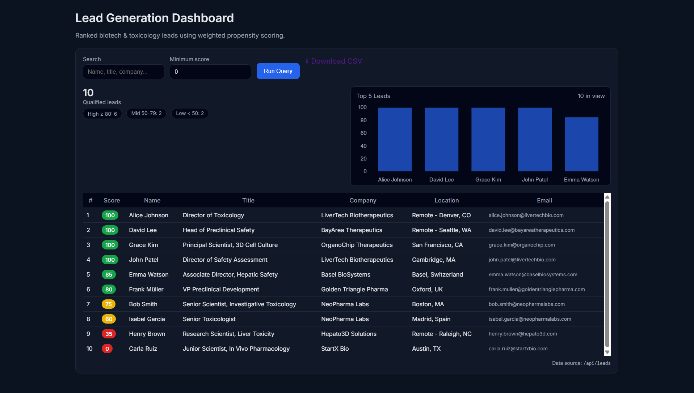
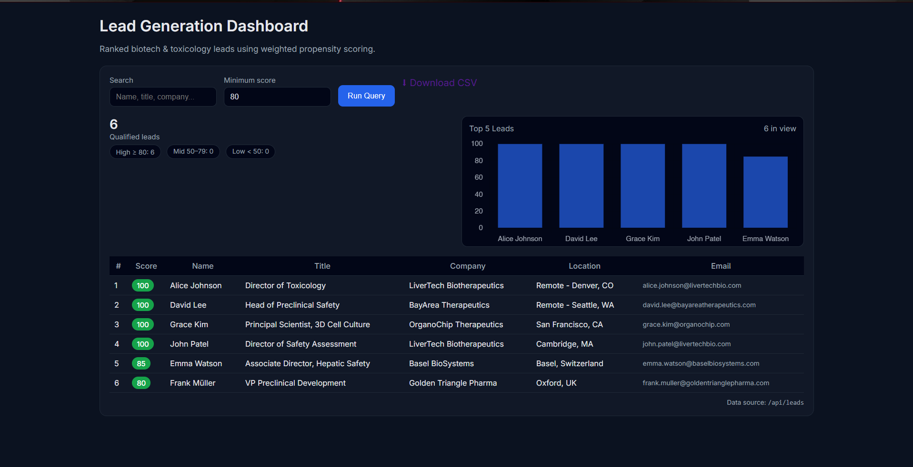
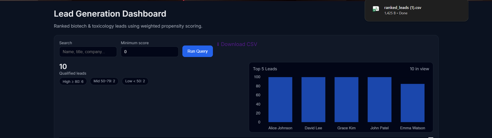

# Lead Generation & Ranking Dashboard – 3D In-Vitro Models

This project is a **proof-of-concept Lead Intelligence Dashboard** built as part of an **Internshala assignment**.  
It demonstrates how a business development team can **identify, enrich, rank, and export high-quality biotech leads** who are most likely to work with **3D in-vitro models for therapy design**.

The focus of this assignment is **decision-making intelligence**, not large-scale web scraping.

---

## 🔍 Problem Statement

Business development teams often face:
- Too many unqualified leads
- No clear way to prioritize outreach
- Manual searching across LinkedIn, publications, and funding news

This project solves that by **ranking leads based on their “Propensity to Collaborate”** using weighted business and scientific signals.

---

## 🧠 Core Concept

Each lead is assigned a **Probability Score (0–100)** based on:

| Signal Category | Description |
|----------------|-------------|
| Role Fit | Seniority and relevance (Toxicology, Safety, Hepatic, 3D) |
| Company Intent | Funding stage (Series A/B/C) |
| Technographic Signals | Use of in-vitro models and openness to NAMs |
| Location | Presence in major biotech hubs |
| Scientific Intent | Recent publications on liver toxicity / DILI |

Higher scores indicate **higher likelihood of collaboration**.

---

## 🔄 Workflow

1. **Identification**  
   Relevant biotech professionals are identified based on role, domain, and location.

2. **Enrichment**  
   Each profile is enriched with:
   - Contact information
   - Location (person vs company HQ)
   - Funding stage
   - Research and technology signals

3. **Scoring & Ranking**  
   A weighted scoring engine calculates a probability score and ranks the leads.

4. **Dashboard Output**  
   Leads are displayed in a searchable, filterable dashboard and can be exported as CSV.

---

## 🖥️ Tech Stack

- **Backend:** Python, Flask
- **Frontend:** HTML, CSS, Vanilla JavaScript
- **Charting:** Chart.js
- **Data Format:** JSON, CSV
- **CORS:** flask-cors

---

## 📊 Features

- Ranked lead table (0–100 probability score)
- Free-text search & minimum score filter
- Top-5 leads bar chart (fixed scale)
- CSV export of filtered & ranked leads
- Clean and responsive dashboard UI

---

## 📁 Project Structure

```text
project-root/
│
├── backend/
│   └── app.py              # Flask API & scoring logic
│
├── frontend/
│   └── index.html          # Dashboard UI
│
└── README.md

## 🖼️ Output Screenshots

### Dashboard Overview


### Filtered & Ranked Leads


### CSV Export

